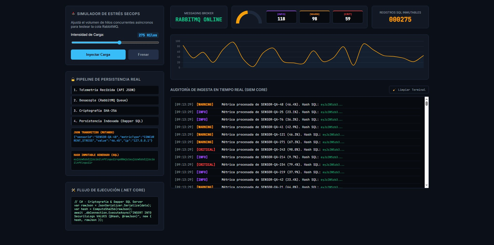
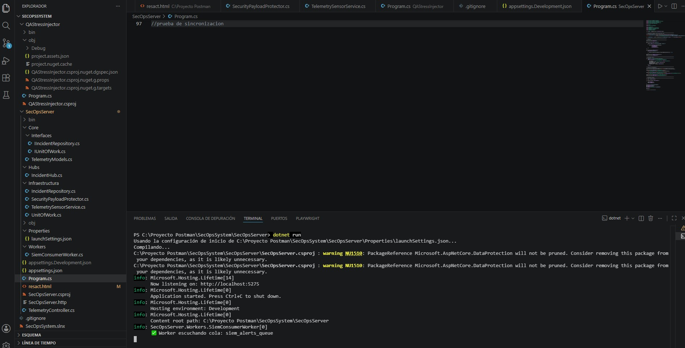
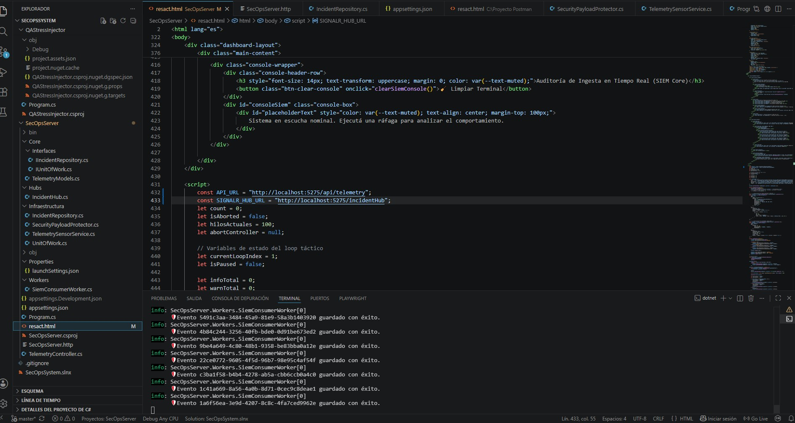
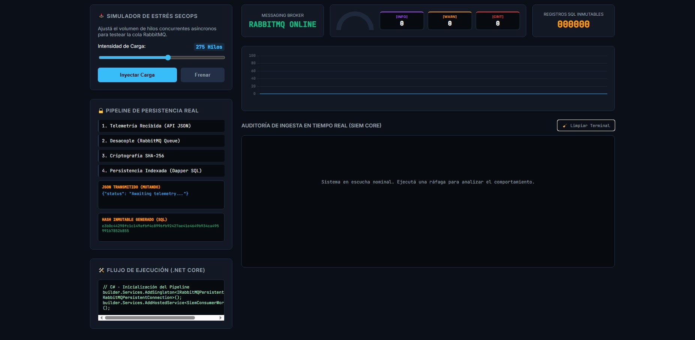
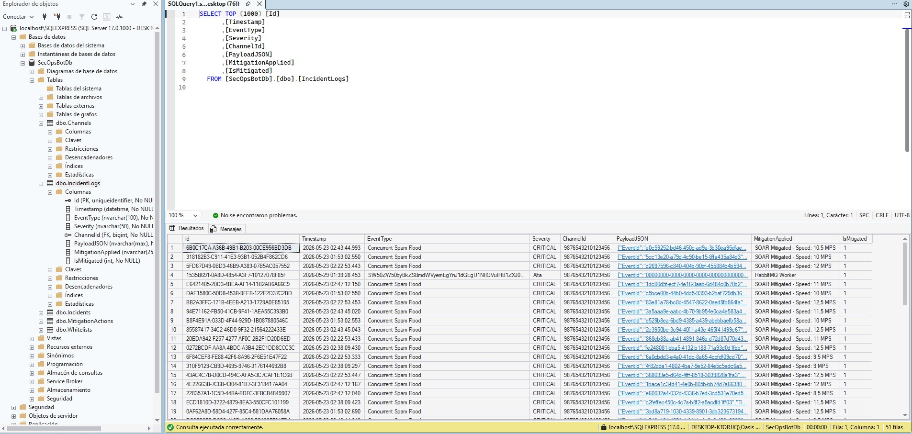
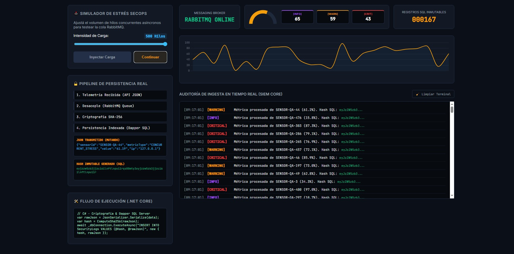
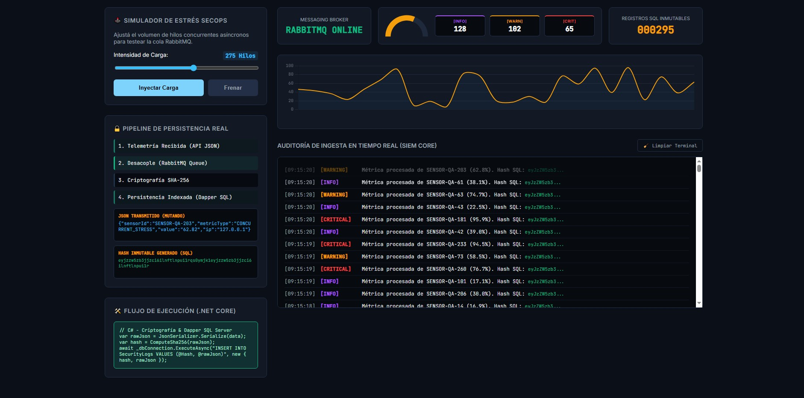

# 🛡️ SecOps-SIEM-SOAR

Plataforma de ciberseguridad desarrollada sobre .NET 10 orientada a la detección, análisis y respuesta automatizada ante incidentes de seguridad.

El proyecto implementa una arquitectura desacoplada de alto rendimiento basada en eventos, capaz de procesar grandes volúmenes de telemetría, persistir evidencia de manera confiable y ejecutar acciones de mitigación en tiempo real.

---

## 🎯 Objetivos

- Detectar eventos de seguridad en tiempo real.
- Procesar grandes volúmenes de telemetría.
- Persistir incidentes para auditoría y análisis forense.
- Automatizar respuestas de mitigación.
- Implementar resiliencia ante fallos de infraestructura.
- Visualizar eventos en vivo mediante dashboard independiente.

---

# 🏗️ Arquitectura General

El sistema sigue una arquitectura distribuida orientada a eventos.

### Componentes principales

- **Backend:** .NET 10
- **ORM:** Dapper
- **Base de Datos:** SQL Server 17
- **Mensajería:** RabbitMQ
- **Frontend:** React + SignalR
- **Resiliencia:** Polly
- **Patrones:** Circuit Breaker, Retry, Failover

---

## 🔄 Flujo de Procesamiento

1. Recepción de telemetría.
2. Publicación de eventos en RabbitMQ.
3. Consumo concurrente mediante workers.
4. Persistencia de incidentes en SQL Server.
5. Notificación en tiempo real mediante SignalR.
6. Ejecución de acciones de mitigación.

---

# 🚀 Simulación de Alta Concurrencia

El sistema fue sometido a pruebas de carga mediante generación masiva de eventos concurrentes.

  

**Resultado:**

- Procesamiento simultáneo de cientos de eventos.
- Sin pérdida de mensajes.
- Persistencia consistente.
- Dashboard actualizado en tiempo real.

---

# 📡 Servicio en Ejecución

Backend escuchando eventos y conexiones entrantes.

  

---

# ⚡ Procesamiento de Ráfagas

Prueba de estrés mediante envío masivo de eventos.

  

El sistema mantiene estabilidad operativa incluso bajo picos abruptos de carga.

---

# 🧹 Recuperación y Limpieza

Mecanismos de limpieza y estabilización posteriores al procesamiento.

  

---

# 🗄️ Persistencia de Incidentes

Todos los eventos procesados son almacenados para auditoría y análisis posterior.

  

Características:

- Persistencia transaccional.
- Trazabilidad completa.
- Evidencia para investigaciones.
- Base para correlación futura.

---

# 🛑 Mitigación Automática

El sistema incorpora acciones de respuesta automatizada para contener amenazas detectadas.

  

Funcionalidades:

- Contención de incidentes.
- Interrupción controlada de flujos.
- Respuesta inmediata ante eventos críticos.

---

# 🔥 Procesamiento Parcial de Ráfagas

Visualización de ejecución durante escenarios de carga continua.

  

---

# 🧠 Características Técnicas

### Backend

- .NET 10
- ASP.NET Core
- SignalR
- Dapper
- SQL Server

### Mensajería

- RabbitMQ
- Productores y consumidores desacoplados
- Procesamiento asíncrono

### Resiliencia

- Polly
- Circuit Breaker
- Retry Policy
- Failover híbrido

### Observabilidad

- Logging estructurado
- Telemetría de eventos
- Dashboard en tiempo real

---

# 📈 Resultados Alcanzados

✅ Arquitectura orientada a eventos

✅ Persistencia confiable de incidentes

✅ Procesamiento concurrente

✅ Dashboard en tiempo real

✅ Integración SignalR

✅ Integración RabbitMQ

✅ Tolerancia a fallos

✅ Mitigación automatizada

---

# 🔐 Casos de Uso

- Security Operations Center (SOC)
- SIEM
- SOAR
- Correlación de eventos
- Respuesta automática a incidentes
- Monitoreo corporativo
- Laboratorios de ciberseguridad

---

# 👩‍💻 Autora

**Gisela**

Cybersecurity | .NET Developer | SIEM/SOAR Engineering

Certificaciones:

- IBM Cybersecurity Fundamentals
- IBM Artificial Intelligence Fundamentals
- Microsoft Learn
- Microsoft Playwright Testing

---

## ⭐ Si te resulta interesante este proyecto

No olvides dejar una estrella al repositorio.
